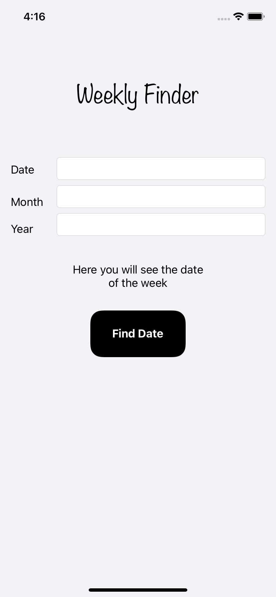
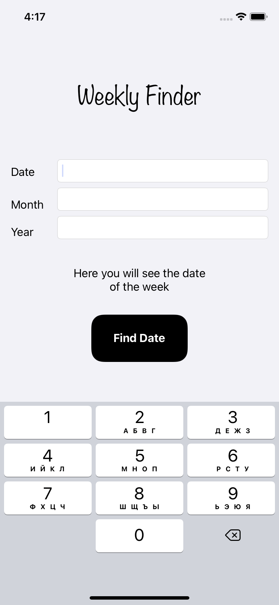
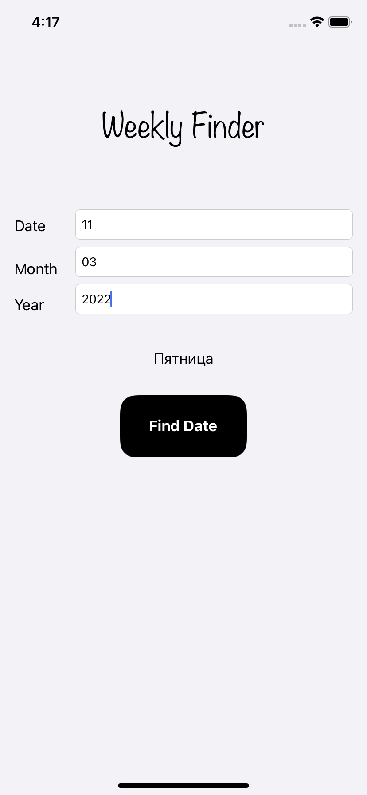

# Study-Project_Weekly-Finder
A learning project as part of a Swift Book course. Application for finding the day of the week by the entered date, month and year.

# 1. Home screen
At the top, there is a Label element in which the name of the application is present. 
 
Next comes the text fiel with an explanation on the left side of the screen: date, month and year. 
 
Below them is a label that displays the requested day of the week. 
 
The bottom element is the "Find Day" button, by means of which the numbers from the fiel text are processed through the calendar and give the desired day of the week. 

# 2. Filling in the fields
When you click on a fillable field, a keyboard is pulled out that contains only numbers.

After filling in the fields, the user should click on the button below "Find Day".

# 3. Result
After clicking on the button in the label element, under the fields to be filled in, the desired day of the week is displayed, in our case, "Пятница".

